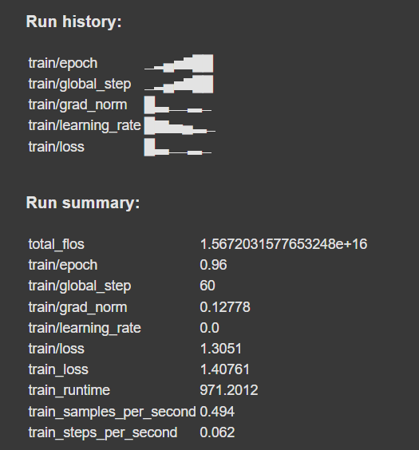

**MediChat : AI Health Assistant Chatbot**

This project developed a creative AI-powered medical chatbot to support users with health-related questions. By fine-tuning a language model on a specialized medical dataset, the chatbot provides accurate and reliable answers tailored to user queries. A streamlined Gradio interface allows users of all skill levels to easily input questions and receive clear, practical responses. Built in Python, the project focuses on efficiency and flexibility, optimizing the model to deliver dependable health guidance in an accessible, user-friendly way, enhancing access to healthcare information.

-------

**PreTrained Model**
 Model: "deepseek-ai/deepseek-llm-7b-chat"

 **Question**: A 61-year-old woman with a long history of involuntary urine loss during activities like coughing or sneezing but no leakage at night undergoes a gynecological exam and Q-tip test. Based on these findings, what would cystometry most likely reveal about her residual volume and detrusor contractions?

**Response(Pretrained Model)**: Based on the gynecological exam and Q-tip test, cystometry most likely reveals that the patient has a small residual volume and that her detrusor contractions are weak. This suggests a diagnosis of overactive bladder. Further testing and evaluation may be necessary to confirm this diagnosis and develop an appropriate treatment plan.

**Response(After Fine-Tuning)**: Based on the Q-tip test results, cystometry is most likely to reveal that the residual volume is high, suggesting the bladder is not emptying fully. This, in turn, may indicate weak detrusor contractions, meaning the muscles responsible for pushing out urine are not functioning optimally. These findings support the idea that there is more to the urinary incontinence than just simple leakage and suggest a potential need for further investigation or treatment.

-------

  

--------

-------

 
